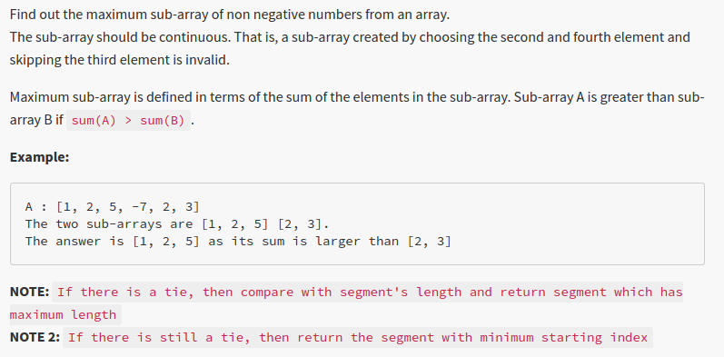

# Question from InterviewBit.com



## Solution in Python


```python
class Invariant:
    def __init__(self, arr_, begin_, sum_, length_=1, end_=2):
        self.array_ = arr_
        self.begin_ = begin_
        self.sum_ = arr_[begin_]
        self.length_ = length_
        self.end_ = end_
    def setSum(self, sum_):
        self.sum_ = sum_
    def setLength(self, length_):
        self.length_ = length_
    def setEnd(self, end_):
        self.end_ = end_
    def setBegin(self, begin_):
        self.begin_ = begin_
    def getSum(self):
        return self.sum_
    def getLength(self):
        return self.length_
    def getEnd(self):
        return self.end_
    def getBegin(self):
        return self.begin_
    def display(self):
        print self.begin_, self.end_
        for i in xrange(self.begin_, self.end_):
            print self.array_[i]


class Solution:
    def __init__(self):
        self.mi = None
    def updateMax(self, ti, arr):
        if not self.mi:
            self.mi = ti
        elif ti.getSum() > self.mi.getSum():
            self.mi = ti
        elif (ti.getSum() == self.mi.getSum()) and (ti.getLength() > self.mi.getLength()):
            self.mi = ti
        elif (ti.getLength() == self.mi.getLength()) and (arr[ti.getBegin()] < arr[self.mi.getBegin()]):
            self.mi = ti
        return self.mi
    # @param A : list of integers
    # @return a list of integers
    def maxset(self, A):
        return_value = None
        i = 0
        while i < len(A):
            # Skip all negative values, at the end of this loop A[i] is first positive
            while A[i] < 0 and i<len(A):
                i = i + 1
            # set first positive as begin_ in a new max candidate
            temp_invariant = Invariant(arr_ = A, begin_ = i, sum_ = 0, length_ = 1, end_ = i+1)
            while i<len(A) and A[i] > 0 :
                temp_invariant.setSum(temp_invariant.getSum() + A[i])
                temp_invariant.setLength(temp_invariant.getLength() + 1)
                i = i + 1
            temp_invariant.setEnd(i)
            return_value = self.updateMax(temp_invariant, A)
        return A[return_value.getBegin():return_value.getEnd()]
            
                
            
                
```


```python
solution = Solution()
```


```python
result = solution.maxset([ 1, 2, 5, -7, 2, 5 ])
```


```python
result
```


    [1, 2, 5]


