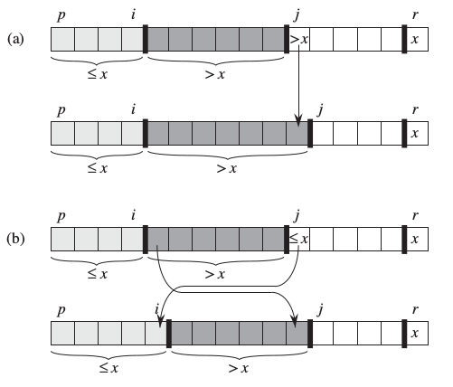
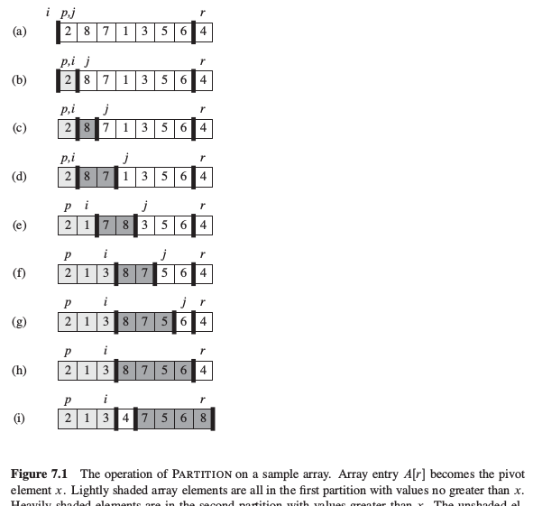

# Selection Algorithms

### [QuickSelect](https://en.wikipedia.org/wiki/Quickselect)

- Wikipedia Says:
    1. In computer science, quickselect is a selection algorithm to find the kth smallest element in an unordered list. It is related to the quicksort sorting algorithm.

## Let's understand QuickSort

### Divide and Conquer Idea: 

#### Divide: 
    The idea is to find a pivot. The pivot is an index q in the array A[p:r], 
    such that all elements of A[p:q-1] are less than or equal to A[q], 
    which is less than or equal to elements of A[q+1:r].
    
    A[p:q-1] and/or A[q+1:r] are/is possibly empty.

#### Conquer:
    Sort the array A[p:r] by recursive calls to Divide
    
#### Combine
    Merge the sorted arrays A[p:q-1] and A[q+1:r]. 
    Because the sub arrays are sorted, the whole array is already sorted. 
    Combine is basically not reqired.

### Let's write the Partition Function

Algorithm for partition:

1. input to the algorithm: Array, p = start index for the sub array, 
    r = end index for the sub array
    1. Initialize i = p - 1 : i is the index that tells that elements from p to i (inclusive) are smaller than Array[r]
2. Case b in the diagram beloww:
    Traverse the array: j=0 to j < r
        if Array[j] is smaller than or equal to Array[r]:
            then, move Array[j] to Array[i+1] and update i to i+1: 
                (Verify in the image below that the loop invariant is satisfied)
            also increment j to make it ready for the next iteration
            iterate with new j
3. Loop has ended: j must be equal to r now: because the above loop's termination condition is that.
    Now i+1 is the first element that is greater than or equal to Array[r]
    swap (i+1)th position and rth position:
    At this stage, till i everything is smaller than Array[r]
    return i+1: i+1 is the pivot.
    



```python
def partition(array, p,r):
    print "**********Working within p:" + str(p) + " and r:" + str(r)
    # initialize data for entering the loop
    i = p - 1
    x = 0
    if r < len(array):
        x = array[r] 
    j = p
    while j < r:
        if array[j] <= x:
            i = i + 1
            print "Swap intermediate i:" + str(i) + " and j:" + str(j)
            array[i], array[j] = array[j], array[i]
            j = j + 1
        else:
            j = j + 1
    print "Swap (i + 1):" + str(i+1) + " and j:" + str(j)
    if i < j:
        array[i+1], array[j] = array[j], array[i+1]
    return i+1

def quicksort(A, p , r):
    if p < r:
        q = partition(A, p, r)
        print A[p:q], A[q], A[q+1:r]
        quicksort(A, 0, q-1)
        quicksort(A, q+1, r)
    else:
        return
    
```


```python
A = [6, 0, 5, 13, 13, 2, 1, 2]
quicksort(A, 0, len(A) - 1)
```

    **********Working within p:0 and r:7
    Swap intermediate i:0 and j:1
    Swap intermediate i:1 and j:5
    Swap intermediate i:2 and j:6
    Swap (i + 1):3 and j:7
    [0, 2, 1] 2 [13, 6, 5]
    **********Working within p:0 and r:2
    Swap intermediate i:0 and j:0
    Swap (i + 1):1 and j:2
    [0] 1 []
    **********Working within p:4 and r:7
    Swap intermediate i:4 and j:4
    Swap intermediate i:5 and j:5
    Swap intermediate i:6 and j:6
    Swap (i + 1):7 and j:7
    [13, 6, 5] 13 []
    **********Working within p:0 and r:6
    Swap intermediate i:0 and j:0
    Swap intermediate i:1 and j:1
    Swap intermediate i:2 and j:2
    Swap intermediate i:3 and j:3
    Swap (i + 1):4 and j:6
    [0, 1, 2, 2] 5 [6]
    **********Working within p:0 and r:3
    Swap intermediate i:0 and j:0
    Swap intermediate i:1 and j:1
    Swap intermediate i:2 and j:2
    Swap (i + 1):3 and j:3
    [0, 1, 2] 2 []
    **********Working within p:0 and r:2
    Swap intermediate i:0 and j:0
    Swap intermediate i:1 and j:1
    Swap (i + 1):2 and j:2
    [0, 1] 2 []
    **********Working within p:0 and r:1
    Swap intermediate i:0 and j:0
    Swap (i + 1):1 and j:1
    [0] 1 []
    **********Working within p:5 and r:6
    Swap intermediate i:5 and j:5
    Swap (i + 1):6 and j:6
    [6] 13 []
    **********Working within p:0 and r:5
    Swap intermediate i:0 and j:0
    Swap intermediate i:1 and j:1
    Swap intermediate i:2 and j:2
    Swap intermediate i:3 and j:3
    Swap intermediate i:4 and j:4
    Swap (i + 1):5 and j:5
    [0, 1, 2, 2, 5] 6 []
    **********Working within p:0 and r:4
    Swap intermediate i:0 and j:0
    Swap intermediate i:1 and j:1
    Swap intermediate i:2 and j:2
    Swap intermediate i:3 and j:3
    Swap (i + 1):4 and j:4
    [0, 1, 2, 2] 5 []
    **********Working within p:0 and r:3
    Swap intermediate i:0 and j:0
    Swap intermediate i:1 and j:1
    Swap intermediate i:2 and j:2
    Swap (i + 1):3 and j:3
    [0, 1, 2] 2 []
    **********Working within p:0 and r:2
    Swap intermediate i:0 and j:0
    Swap intermediate i:1 and j:1
    Swap (i + 1):2 and j:2
    [0, 1] 2 []
    **********Working within p:0 and r:1
    Swap intermediate i:0 and j:0
    Swap (i + 1):1 and j:1
    [0] 1 []


```python
A
```


    [0, 1, 2, 2, 5, 6, 13, 13]


# Questions from CLRS:

1. 7.1-1
    Using Figure 7.1 as a model, illustrate the operation of PARTITION on the array
    A = [13, 19, 9, 5, 12, 8, 7, 4, 21, 2, 6, 11]
    
    
    Answer:
    
    When the function finishes the array looks like the following:
    [9, 5, 8, 7, 4, 2, 6, 11, 21, 13, 19, 12]
    where index of 11 is the pivot.

    
2. 7.1-2
    What value of q does Partition function return when all elements in the array A[p..r]
    have the same value? Modify Partition function so 
    that $$ q = \left\lfloor\dfrac{p+r}{2}\right\rfloor $$ 
    when all elements in the array A[p..r] have the same value.
    
    Answer: If all the elements in the array A[p..r] are same then Partition function tries to swap
    each element with itself for the whole array. Partition function would return the last index of 
    the array.
    
    Also look at [StackOverflow link](http://stackoverflow.com/questions/31488933/cormen-quick-sort-modify-partition-function)


```python
def partition2(array, p, r):
    i = p - 1
    q = p
    x = array[r]
    all_equal = False
    if array[q] == x:
        all_equal = True
    while q<r:
        if array[q] == x:
            i = i + 1
            q = q + 1
        elif array[q]<x:
            all_equal = False
            i = i + 1
            array[q], array[i] = array[i], array[q]
            q = q + 1
        else:
            all_equal = False
            q = q + 1
    # assert j = r
    if all_equal == True:
        import math
        return math.floor((p+r)/2)
    else:
        array[i+1], array[q] = array[q], array[i+1]
        return i+1
```


```python
partition2([2, 2, 2, 2, 2], 0, 4)
```


    2.0


    
3. 7.1-3
    Give a brief argument that the running time of Partition on a subarray of size n
    is $\Theta{(n)}$.
    
    Answer: To show that the running time of Partition on a subarray of size n is $\Theta{(n)}$ , all we need to do is to show that its $\mathcal{O}(n)$ and $\Omega{(n)}$
    
    So, in the worst case scenario, the Partition algorithm has to traverse the whole array once. This proves that lower bound of Partition algorithm is $\Omega{(n)}$
    In the best case scenario as well Partition function at least needs to increment q for each element in the array. This proves that the algorithm has an upper bound of $\mathcal{O}(n)$

4. 7.1-4
    How would you modify QUICKSORT to sort into nonincreasing order?


```python
#Answer to 7.1-4:
    #In the partition function just change "<=" to ">="
def partition_decreasing_order(array, p, r):
    i = p - 1
    if p == r:
        return p
    x = array[r]
    q = p
    while q<r:
        if array[q]>=x:
            i = i + 1
            array[q], array[i] = array[i], array[q]
            q = q + 1
        else:
            q = q + 1
    #assert q = r
    array[i+1], array[q] = array[q], array[i+1]
    return i+1

def quicksort_decreasing_order(A, p, r):
    if p < r:
        q = partition_decreasing_order(A, p, r)
        quicksort_decreasing_order(A, p, q-1)
        quicksort_decreasing_order(A, q+1, r)
```


```python
A = [2, 3, 1, 6, 5, 9]
quicksort_decreasing_order(A, 0, 5)
```


```python
A
```


    [9, 6, 5, 3, 2, 1]


# Unit Testing QuickSort

Get started with [pytest](http://docs.pytest.org/en/latest/getting-started.html#installation)


```python
import pytest
```


```python
def test_quicksort():
    A = [2, 3, 1, 6, 5, 9]
    p = 0
    r = len(A) - 1
    quicksort_decreasing_order(A, p, r)
    assert A == [9, 6, 5, 3, 2, 1]
```


```python
test_quicksort()
```


```python
def test_quicksort_trivial():
    A = [1]
    p = 0
    r = len(A) - 1
    quicksort_decreasing_order(A, p, r)
    assert A == [1]
```


```python
test_quicksort()
```


```python
test_quicksort_trivial()
```
