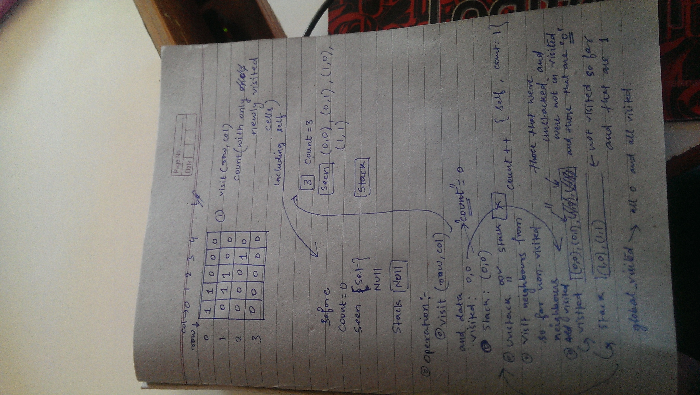

Approach:

For each element in the matrix:
    stack it
    while the stack is not empty:
        unstack it and check it's neighbours
            if it's in the global_visited set then get out of the while loop
            else
                if the unstacked matrix position has 0, add it to global_visited, i.e ignore list
                if the unstacked position has 1, then visit it's neighbours, i.e stack the neighbours in the to be visited list
                    also increase the count
                    add the unstacked position into global_visited set
    save the count for this element of the matrix
    
    
Lessons learnt:
    approach the problem like a story and don't involve technology until implementation is required


```python
# Define the matrix to be tested
Arr = [
    [1, 1, 0, 0, 0],
    [1, 1, 1, 1, 0],
    [0, 0, 0, 1, 0],
    [1, 0, 0, 0, 0]
]
```


```python
# initialize the global_visited set to hold 0 and cells on which dfs has already finished running
global_visited = set()
```


```python
# define the function to get the element, given matrix, row and col
def getElement(matrix, row, col):
    if row < 0 or (row > (len(matrix) - 1)) or col < 0 or (col > (len(matrix[0]) - 1)): return -1
    return matrix[row][col]
```


```python
# Test the function getElement
getElement(Arr, 2, 3)
```


    1


```python
# Define directions that cover the neighbour of the cell
directions = ((-1, -1), (0, -1), (1, -1), (-1, 0), (1, 0), (-1, 1), (0, 1), (1, 1))
# count map to hold the count for each position that is 1 and not visited so far
count_map = {}

# first two lines let you access each element of the matrix
for row in xrange(len(Arr)):
    for col in xrange(len(Arr[0])):
        # initialize the variables
        stack = list()
        stack.append((row, col))
        count = 0
        #run dfs and update count when it makes sense
        while len(stack)>0:
            _row_, _col_ = stack.pop()
            # Just add the cell to global_visited is it's 0 and continue with row, col loop
            # ignore the cell if it's 0 else 
            if getElement(Arr, _row_, _col_) == 0: global_visited.add((_row_, _col_))
            #if it's one then make sure it's not seen before
            elif (_row_, _col_) not in global_visited:
                count += 1
                # add it to global_visited and visit all it's neighbour
                global_visited.add((_row_, _col_))
                for x in xrange(0, 8):
                    __row__, __col__ = _row_ + directions[x][0], _col_ + directions[x][1]
                    if getElement(Arr, __row__, __col__) == 1: 
                        stack.append((__row__, __col__))
                    elif getElement(Arr, __row__, __col__) == 0:
                        global_visited.add((__row__, __col__))
        count_map.update({(row, col): count})
print count_map
```

    {(0, 1): 0, (1, 2): 0, (3, 2): 0, (0, 0): 7, (3, 1): 0, (3, 3): 0, (3, 0): 1, (2, 2): 0, (1, 1): 0, (1, 4): 0, (0, 2): 0, (2, 0): 0, (1, 3): 0, (2, 3): 0, (2, 1): 0, (0, 4): 0, (2, 4): 0, (1, 0): 0, (3, 4): 0, (0, 3): 0}


```python
max_ = 0
for value in count_map.values():
    max_ = max(value, max_)
print max_
```

    7

